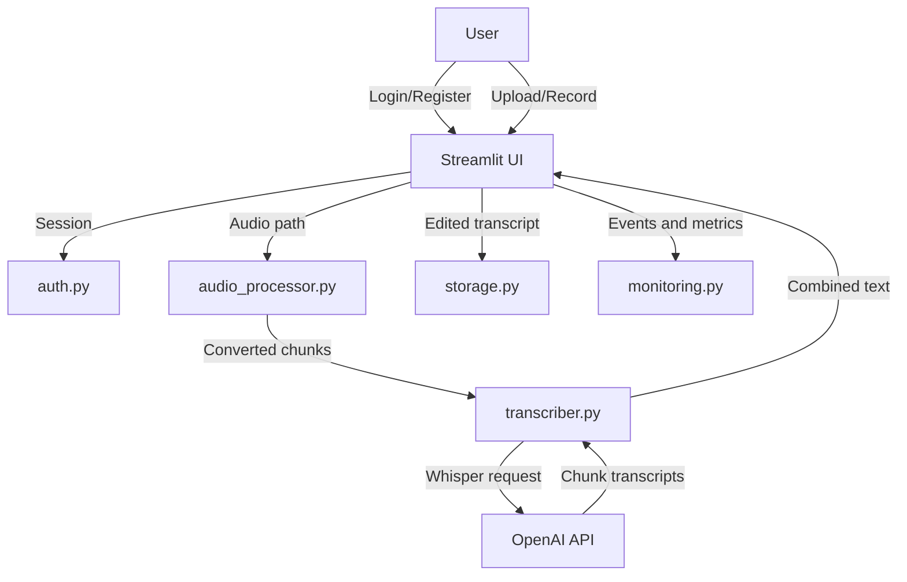

# Architecture

The application is a Streamlit app with a small set of Python modules behind it. The primary runtime path is:

1. `app.py` renders authentication, upload/record controls, transcription progress, transcript editing, saving, and download.
2. `auth.py` manages local JSON-backed users and 24-hour sessions.
3. `audio_processor.py` converts audio with FFmpeg, reads duration with FFprobe, and splits long audio into chunks.
4. `transcriber.py` sends each chunk to OpenAI Whisper and cleans up generated temporary WAV files.
5. `storage.py` saves edited transcripts under `data/transcripts/`.
6. `monitoring.py` writes application logs and transcription metrics under `logs/`.

## Persistence

This project currently uses local files:

- `data/users.json` for user password hashes
- `data/sessions/` for session files
- `data/transcripts/` for saved transcripts
- `data/batch_jobs/` for batch job metadata
- `logs/` for logs and performance metrics

That design keeps the project simple for portfolio/demo use. A production multi-user deployment should move these concerns to managed database/object storage and use a stronger password hashing scheme.
